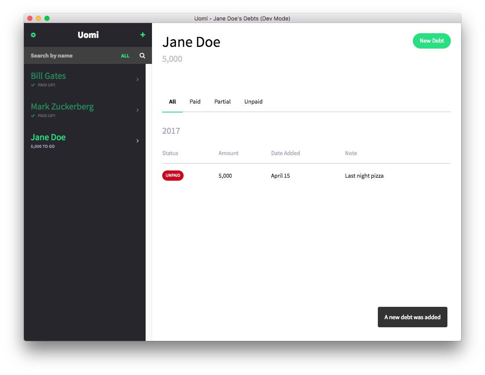

# Uomi
[WIP] A user-friendly personal debt tracker tool



## Developing
```
# Setup
cp .env.example .env # Setup env
npm start # Run build and watch for changes
open public/index.html # Open app

# Build for production
npm prod
```

## Attribution
Thanks to the following:
- [Netguru](https://dribbble.com/shots/2942286--Freebie-Cartoon-Characters-vol-2) for [Nerd illustration used in the default page](https://dribbble.com/shots/2942286--Freebie-Cartoon-Characters-vol-2)
- [Netguru](https://dribbble.com/shots/2942286--Freebie-Cartoon-Characters-vol-2) for [Beard illustration in the default page](https://dribbble.com/shots/2942286--Freebie-Cartoon-Characters-vol-2)
